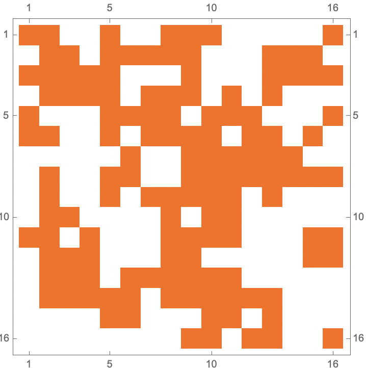
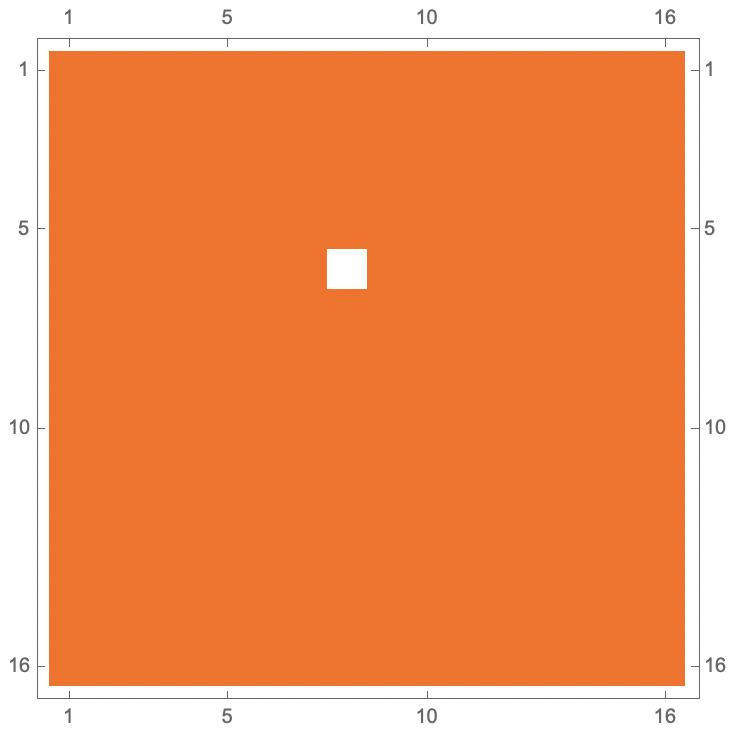
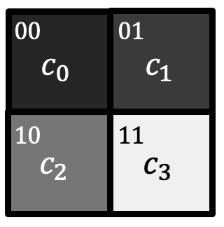
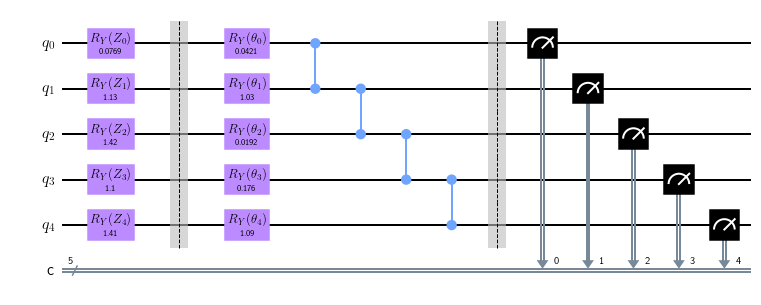

# Introduction
Ice, water and steam - three things that are all composed of the same fundamental molecule; three things that could not be less alike. Moreover, as the temperature of vessel of water is increased to $100^\circ$ C, the water begins to boil and violently changes in character. In such a setting, ice, water and steam are referred to as "phases", and water is said to have undergone a "phase transition"Understanding the diversity that emerges from the interactions of **several** particles is a central theme in the field of condensed matter physics.

A paradigmatic model that is used to illuminate the physics behind such phase transitions is the Ising model, a classical model of magnetic dipoles, noted for its combination of simplicity and rich phenomenology.

## The Ising Model

The Ising model is defined by a set of classical variables which can take the values $\pm 1$, each placed on the vertex of a two dimensional square lattice. These variables are intended to represent magnetic dipoles (or "spins"), and their values indicate the direction in which they point (up or down). The energy of this model is given by 

$H = -J\sum_{\langle i,j\rangle} s_i . s_j$

where $\langle i,j \rangle$ denotes pairs of nearest neighbors in the lattice. When $J>0$, the energy of the spins is the lowest when they are all aligned. This is, in fact, the defining feature of the system at low temperatures. However, as the system is heated beyond a *critical* temperature, the spins receive enough energy from the environment to point in random directions. The qualitative features of the aligned/unaligned configurations show a stark enough difference that these are said to belong to two different "phases" - a ferromagnetic phase, if the spins are aligned, and a paramagnetic phase otherwise.

**The disordered phase**

**The ordered phase**

## Project Objective

For this project, our aim was to use a quantum computer to generate a configuration of spins corresponding to each phase. Specifically, our program generates a "typical" configuration, given a temperature. Our implementation consists of the following steps:

0. Encoding two dimensional grid on a quantum state
1. Creating a quantum classifier using the Quantum Hadamard Edge Detection protocol
2. Using a variational generator capable of generating random configurations
3. Combining the two to obtain a Generative Adversarial Network that successfully generates a typical configuration

### Encoding

Naively, one might assume that $N$ qubits are needed in order to encode a grid of $N$ points. In such a scheme, we would have a qubit for each point, and its amplitude could denote the configuration at that point. However, that would not utilize the "quantum-ness" of qubits, which can store such grids with exponentially greater efficiency. To see how, consider the simple case of a $2\times2$ square grid, consisting of $N=4$ points.

Each point on the grid is labelled with a number $i$ from 0 to $N-1$ in a sequential manner, e.g. starting from 0 at the bottom left, increasing the label by 1 as we move left, and wrapping around at the end. Upon representing these $i$s in binary, one can see that flipping the last qubit moves us one step to the left/right, and flipping the second last qubit moves us one step up/down. 

This naturally lends itself to being represented as a quantum state. For simplicity, we assume that the grid is square, and moreover, has sides of length $2^n$ (if not, we can extend and pad the grid accordingly). By considering a quantum state of $n$ qubits, we can

1. Identify each possible state with a location on the grid
2. Construct a superposition of all possible states, with the amplitude of each state representing the spin orientation at that site

### Classifying

Each configuration of the classical system admits a description in terms of quantities called "domain walls", in addition to the usual enlisting of $s_\mathbf{x}$ at each point $x$ on the grid. A domain wall is a line that separates a region of up spins ($s=1$) from a region of down spins ($s=-1$). When all spins are nearly aligned, we have few domain walls in the configuration. The number of these walls balloons as the temperature is increased, owing to the several pockets of neighboring up and down spins that will emerge.

Since these domain walls separate regions of up from down spins, serving as "edges" between qualitatively different regions, we decided to use the Quantum Hadamard Edge Detection protocol to determine the total length of all the edges. We found that there was a sharp difference in the length of edges between the ferromagnetic and paramagnetic phases, solidifying our choice to use this as a classification.

(Illustration of quantum Hadamard edge detection algorithm. Credits: qiskit.org/learn)

### Improved Edge Counting
Probing the probability amplitude directly from the measurement statistics can be hard, and resource comsuming, especially when the probability amplitude is small. We propose a simple protocol here for counting the number of edges detected by the QHED. 

By only investigating the statistics of the measurement outcome of the last qubit. The probability of getting $|1\rangle$ is the of the order of $O(\frac{N_e}{N_s})$, $N_e$ being the number of edges and $N_s$ is number of edges, the precise expression of which depends on the way of encoding images into the quantum state. The measurement technique makes it possible to obtain a precise counting of the edges using only reasonable amount of samplingls. 

### Generator

Our prototype involves using a variational quantum circuit to generate a random state, which is then fed to the classifier. Noting that the classifier has already been trained, it rejects or accepts the state. This state should be interepreted as an encoding of the final classical configuration, corresponding to the input temperature.

The structure of our generator utilizes the all-to-all coupling of the trapped ion system to apply a combination of CNOT and CCX gates to all the qubits, interspersed with rotations about the Y-axis. The angles of these rotations, distributed in the interval $[0,\frac{\pi}{2}]$ are the variational parameters that are updated based on the classifier's decision.

(Illustration of the generator)

## Future Directions
We intended this project to be proof of the concept that quantum computers could be used to rapidly generate random states subject to certain constraints. Going forward, we hope to extended such a method to models where the degrees of freedom are continuous, where domain walls could be drawn on a coarse-grained configuration. The efficiency of the image encoding scheme means that such a protocol can be immediately extended to higher dimensions, where human visualization often falters.
