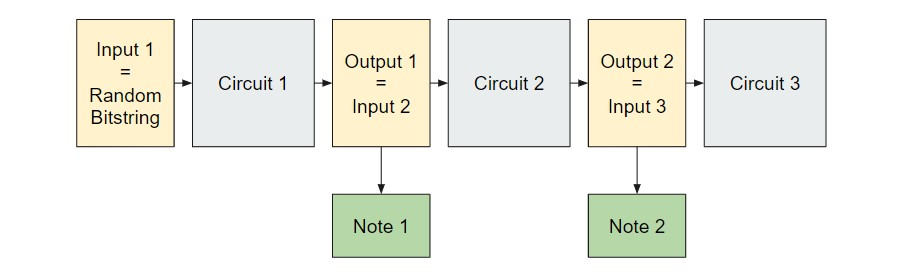
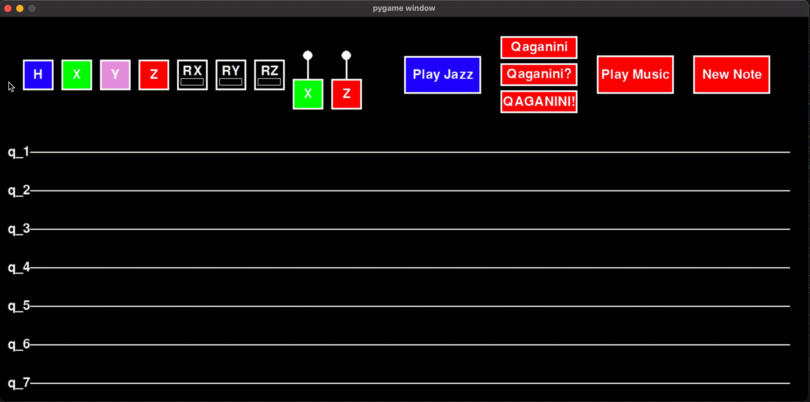
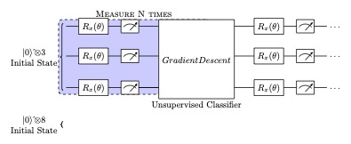

# Variations on a Theme of Qaganini

Ever wondered what “quantum music” sounds like? Come, take a listen to Qaganini, the world-renowned quantum composer (qomposer)! And if you like what you hear, you too can become a qomposer and create your very own quantum sheet music!

## Functionalities

There are three main ways to generate music:

- **Auto Mode**: Qaganini will create a piece of quantum sheet music. You can request for Qaganini to play this piece of music multiple times. Due to the quantum nature of his music, each time he plays it, it will exhibit different variations!

- **Manual Mode**: You can create your own quantum sheet music by composing different quantum gates together to form rich quantum circuits. Experiment to see what sort of music you can create, and listen to its multiple variations!

- **Auto-Style Mode**: Qaganini can also create music in different styles - jazz, classical, pop, and more. Select a style, and Qaganini will train a quantum circuit to generate rhythms of this style!

In the application window, you can click on the quantum gates in the top row to select them, and then select a row on the quantum circuit to place the gate down. For the two-qubit gates, you have to select the control row followed by the target row.

## Problem Statement

Our project seeks to make use of quantum randomness and entanglement in order to create pieces of music that sound different every time they are played. In order to do so, we need a method of extracting musical notes from a quantum circuit. We also want to devise a system such that each note depends on the previous notes, so that we do not just get random strings of notes.

The final component focuses on generating music in a certain style, where we were able to use quantum machine learning methods to generate rhythms of each style.

## Big Picture Approach

Our main implementation consists of a Python class, `Composer`. The `Composer` class contains as one of its fields a list of Qiskit `QuantumCircuit`’s. Each circuit corresponds to 1 musical note. The main idea is to simulate each circuit on a set of input qubits and measure the circuit to obtain a string of bits. We then apply a mapping function that associates each possible bitstring with a note with a particular pitch and duration. The string of musical notes is then played out loud to the user.

Because quantum states can lie in superposition of the computational basis, the act of measurement collapses the qubits non-deterministically. This means that the string of musical notes derived on each playing can vary.

Furthermore, so that the string of musical notes are correlated, we form the inputs to each circuit in the following manner: The input to the first circuit (corresponding to the first note) is the all $0$’s state. The input to all subsequent circuits is then set to be the output of the previous circuit. So, for example, if the measurement of circuit 1 gives the bitstring $’0000001’$, the input to circuit 2 is set to be $|0000001\rangle$. This ensures that the quantum sheet music has musical coherence, rather than being a random sequence of notes.

## Implementation Details
The first 3 qubits correspond to the length of the note, and the last 5 correspond to a specific pitch.

### Graphical User Interface

The graphical user interface was implemented in `pygame`. Through the game engine, users are able to select from a collection of common gates (Pauli gates, Hadamard gates, CNOT, CZ, rotation gates) and place them on a quantum circuit. This circuit will be used to produce the first musical note of the tune. After they are done, the user can click the ‘New Note’  button. On the backend, this causes a new `QuantumCircuit` object to be created and placed at the end of the list. The GUI will refresh by removing all currently placed gates and displaying an empty quantum circuit. This repeats until the user decides to finish writing the sheet music. At that point, the user presses “Play music”, which will submit the jobs to the quantum hardware.

### How to use the GUI:

- **New Note**": Drag and drop the H, X,Y,Z, CX, CZ and R gates with custom paratemer values onto the circuit. Press "New Note" when you are done to add to your note sequence.
- **Quaganini**:  Press this button to randomly generate a 3-gate circuit for a note.
- **Quaganini?**: Press this button to randomly generate a 5-gate circuit for a note.
- **QUAGANINI**: Press this button to randomly fill the circuit with an arbritary number of gates. 
- **Play Music**: Select this button when you have finished creating your notes to playback your sequence. 

### Communicating with IonQ Provider

When we want to play the quantum sheet music, we take the quantum circuits defined as part of the sheet music and submit it to the IonQ backend one by one. Since we want to sample a random measurement from the superposition generated by the circuits, we submit each job with `shots=1`. When the results of the job is returned, it is stored as a bitstring. The same bitstring is used to initialize the next quantum circuit by calling `QuantumCircuit.prepare_state`. Both submission to the simulator and qgpu backends is possible, although due to the serial nature of this algorithm, submitting to the qgpu requires a long time to complete.

## Generating and Learning Music of a Given Genre

Using the same structure as our previous circuits, we used quantum gradients with backpropagation to learn gates of a quantum circuit which generates jazz music from an ensemble of notes.

### Loss Function

`compute_acc(midi_file)` is a function that takes in a MIDI file and outputs its similarity to the jazz style. To do so, we first compute features for each audio track in the GTZAN dataset, the most-used public dataset for evaluation in machine listening research for music genre recognition (MGR), as well as a feature for `midi_file`. We then use these features to compute the 100 nearest neighbors of `midi_file` in the dataset. The output of `compute_acc()` is then the proportion of the neighbors that are labelled as jazz, and the loss function used in the following steps is $1-$`compute_acc(midi_file)`.

Note: To run the code, first download the GTZAN dataset from https://www.kaggle.com/datasets/andradaolteanu/gtzan-dataset-music-genre-classification. The dataset contains 10 genres with 100 audio files each, all having a length of 30 seconds. See the full implementation in `classifygenre.py`.

### Forward-pass

1. First, we initialize our state into the $|00000000\rangle$ state.
2. Apply variable $R_x(\theta)$ gates to Qubit 0, 1, and 2, which are the rhythm qubits.
3. Measure all 8 qubits to generate 1 note.
4. Keep this last measurement as the next circuit's input.
5. Repeat steps 2-4 for however many notes we want in our musical piece.
6. Pass this list of length 8 bitstrings into `write_to_midi()` which creates the musical sound file. 
7. Onece we have a musical sound file of all the notes, we find the similarlity to a certain style (ie., for the rest of this explanation, we will use jazz as the style of choice) through `compute_acc()`.

### Backpropagation

8. Next, since this is a novel combination of quantum gates using backpropagation techniques, we had to calculate the graadients manually. Given this metric of how close the musical piece is to jazz, we calculate the gradients of each gate with respect to $\theta$, the rotation angle of the $R_x$ which we can vary. Based on these gradients, we nudge the gate parameters in the direction of its gradient to eventually reach a higher similarity factor using the parameter shift rule.
9. Repeat until the similarity of a forward pass passes a certain threshold.

*Here is a visual of the hybrid quantum-classic circuit.*

All of this is implemented in `learning.py` for more details!

Given the constrained nature of a hackathon, we only had time to train 1 genre of music (jazz) 'overnight' for 4 hours, and are proud of the demo you can listen to. Additionally, we only vary and learn the rhythm qubits for two reasons -- one is so we have fewer weights to learn. Two, in terms of most learnable patterns, different genres of music are often distinguished by rhythms. For example, jazz has a lot of syncopated beats, classical music has many melodic continuous notesm, etc. Thus, we designed the quantum circuit for these 2 beneficial purposes.

## Results

You can listen to the `.midi` files in the folder `qaganini-samples` to learn what the music produced from the quantum sheet music sounds like! The files there are all produced by the same piece of quantum sheet music!

### Benefits

- With only 8 qubits, we are able to generate almost all rhythms from 16th notes to whole notes, and reach a range of over 2.5 octaves of notes. This breadth of songs that we can create with so few qubits really optimizes the quantum computer's intrinsic physics.
- Noise is not harmful to our quantum music generator, it only adds variation.
